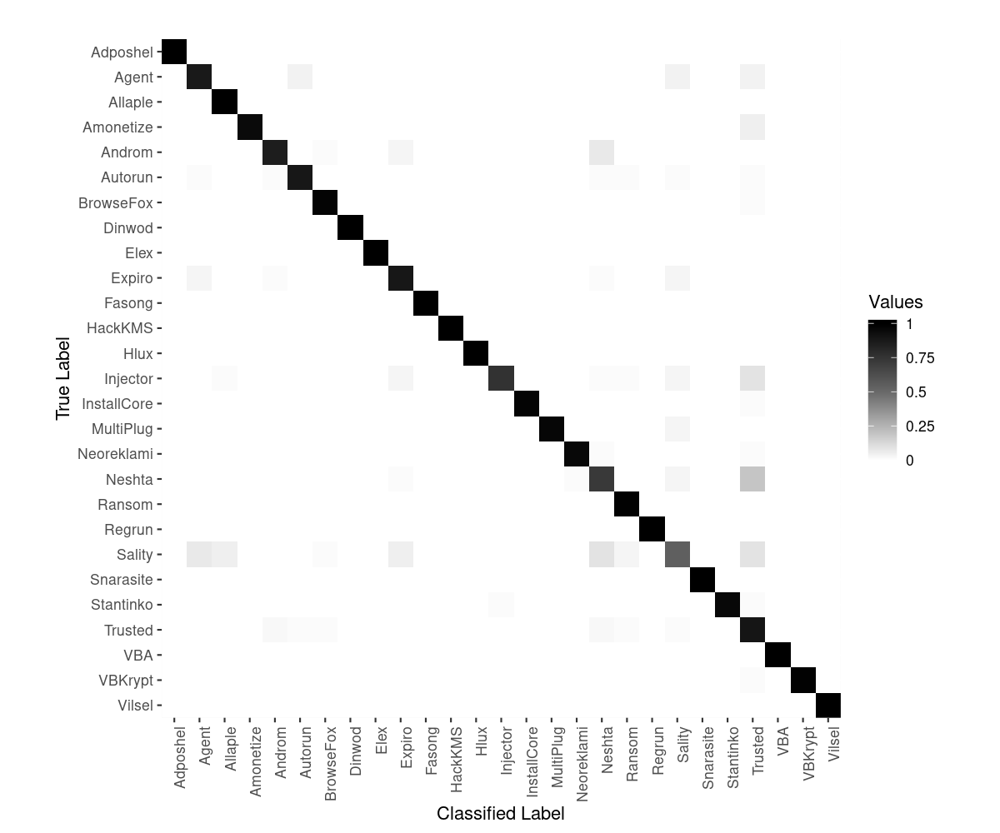

# ClaRAnsom

> For Clara's ransom (cit. Anonymous 🙂)

### Tool for Image-based Malware Analysis based on the paper 'Assessing Deep Learning Prediction in Image-based Malware Detection with Activation Maps'

Repository to replicate the experiments presented in 'Assessing Deep Learning Prediction in Image-based Malware Detection with Activation Maps' by Iadarola G. et al. The complete experimental results are reported in the [**Experiments**](#results) section, while followed by the [**instructions**](#gettingstarted) to install and run the tool.

If you are using this repository, please consider [**citing our works**](#publications) (see links at the end of this README file).

This repository contains the code to strictly replicate the experiments, but it is based on the [TAMI](https://github.com/Djack1010/tami) repository, which constitute the main repository.

## Experimental Results
<a name="results"></a>

The methodology was tested on a dataset of 15726 malware samples, split into 25 malware family and 1 trusted class. We tested two different CNN model architectures (see `models_code` folder), and we refer to them as `CNN` and `VGG16`. The `CNN` model is lighter than the `VGG16` one, it has only 6 layers instead of 16.

We report the experimental results for the [**two DL models**](#models), and a wider comparison per [**malware family**](#families). Also, the [**confusion matrix**](#cm) with the results of the `CNN` on the test set is reported. We refer to the [**original paper**](#publications) for further information on the experiments, and the discussion of the results. 

#### The Dataset

The 15726 dataset samples are split into train-validation-test set, equally balanced by family samples, with a ratio of 80/10/10 of the entire dataset (respectively, 12574/1563/1589 samples). In details, the dataset contains the numbers of samples listed below:

| **Malware Family**      |    Training    |  Validation   |  Test | Total |
| :---------------------- | :------------: | :-----------: | :---: | :---: |
|Adposhel      |   395      |   49      |   50       |    494 |
|Agent      |   376      |   47      |   47       |    470 |
|Allaple      |   382      |   47      |   49       |    478   |
|Amonetize      |   397      |   49      |   51       |    497   |
|Androm      |   400      |   50      |   50       |    500   |
|Autorun      |   396      |   49      |   51       |    496   |
|BrowseFox      |   394      |   49      |   50       |    493   |
|Dinwod      |   399      |   49      |   51       |    499   |
|Elex      |   400      |   50      |   50       |    500   |
|Expiro      |   400      |   50      |   51       |    501   |
|Fasong      |   400      |   50      |   50       |    500   |
|HackKMS      |   399      |   49      |   51       |    499   |
|Hlux      |   400      |   50      |   50       |    500   |
|Injector      |   396      |   49      |   50       |    495   |
|InstallCore      |   400      |   50      |   50       |    500   |
|MultiPlug      |   399      |   49      |   51       |    499   |
|Neoreklami      |   400      |   50      |   50       |    500   |
|Neshta      |   397      |   49      |   51       |    497   |
|Ransom      |   1600      |   200      |   200       |    2000   |
|Regrun      |   388      |   48      |   49       |    485   |
|Sality      |   399      |   49      |   51       |    499   |
|Snarasite      |   400      |   50      |   50       |    500   |
|Stantinko      |   400      |   50      |   50       |    500   |
|Trusted      |   1465      |   183      |   184       |    1832   |
|VBKrypt      |   396      |   49      |   51       |    496   |
|Vilsel      |   396      |   49      |   51       |    496   |
|TOTAL      |   12574      |   1563      |   1589       |    15726   |

#### DL models results
<a name="models"></a>

| **DL model**            |    CNN    |  VGG16   |
| :---------------------- | :-------: | :------: |
| **Img size x channels** |   250x3   |  250x3   |
| **Epochs & Batch Size** |   20&30   |  20&30   |
| **Layers**              |     6     |    16    |
| **Loss**                |   0.35    |  0.327   |
| **Accuracy**            | **0.934** |   0.93   |
| **Precision**           | **0.951** |  0.936   |
| **Recall**              | **0.927** |  0.926   |
| **F-Measure**           | **0.939** |  0.931   |
| **AUC**                 |   0.989   | **0.99** |

#### Malware family comparison
<a name="families"></a>

|                 | **MODELS** | **ACCURACY** | **PRECISION** | **RECALL**  | **FM**      | **AUC**     | **Intra-family-SSIM** | **Inter-models-SSIM** |
| :-------------- | :--------- | :----------- | :------------ | :---------- | :---------- | :---------- | :------------- | :------------- |
| **Adposhel**    | CNN<br>VGG    | 1.000<br>0.999  | 1.000<br>0.980   | 1.000<br>1.000 | 1.000<br>0.990 | 1.000<br>1.000 | 0.503<br>0.652    | 0.387          |
| **Agent**       | CNN<br>VGG    | 0.991<br>0.993  | 0.837<br>0.857   | 0.872<br>0.894 | 0.854<br>0.875 | 0.934<br>0.945 | 0.364<br>0.460    | 0.324          |
| **Allaple**     | CNN<br>VGG    | 0.998<br>0.997  | 0.925<br>0.907   | 1.000<br>1.000 | 0.961<br>0.951 | 0.999<br>0.998 | 0.262<br>0.536    | 0.215          |
| **Amonetize**   | CNN<br>VGG    | 0.998<br>0.997  | 1.000<br>0.960   | 0.941<br>0.941 | 0.970<br>0.950 | 0.971<br>0.970 | 0.710<br>0.703    | 0.271          |
| **Androm**      | CNN<br>VGG    | 0.991<br>0.993  | 0.860<br>0.976   | 0.860<br>0.800 | 0.860<br>0.879 | 0.928<br>0.900 | 0.364<br>0.520    | 0.334          |
| **Autorun**     | CNN<br>VGG    | 0.994<br>0.991  | 0.918<br>0.833   | 0.882<br>0.882 | 0.900<br>0.857 | 0.940<br>0.938 | 0.278<br>0.474    | 0.260          |
| **BrowseFox**   | CNN<br>VGG    | 0.997<br>0.995  | 0.925<br>0.887   | 0.980<br>0.940 | 0.951<br>0.913 | 0.989<br>0.968 | 0.298<br>0.535    | 0.292          |
| **Dinwod**      | CNN<br>VGG    | 1.000<br>0.999  | 1.000<br>1.000   | 1.000<br>0.980 | 1.000<br>0.990 | 1.000<br>0.990 | 0.357<br>0.624    | 0.257          |
| **Elex**        | CNN<br>VGG    | 1.000<br>0.998  | 1.000<br>1.000   | 1.000<br>0.940 | 1.000<br>0.969 | 1.000<br>0.970 | 0.375<br>0.613    | 0.313          |
| **Expiro**      | CNN<br>VGG    | 0.991<br>0.990  | 0.833<br>0.840   | 0.882<br>0.824 | 0.857<br>0.832 | 0.938<br>0.909 | 0.361<br>0.486    | 0.330          |
| **Fasong**      | CNN<br>VGG    | 1.000<br>1.000  | 1.000<br>1.000   | 1.000<br>1.000 | 1.000<br>1.000 | 1.000<br>1.000 | 0.366<br>0.606    | 0.262          |
| **HackKMS**     | CNN<br>VGG    | 1.000<br>0.999  | 1.000<br>1.000   | 1.000<br>0.980 | 1.000<br>0.990 | 1.000<br>0.990 | 0.624<br>0.722    | 0.339          |
| **Hlux**        | CNN<br>VGG    | 1.000<br>0.996  | 1.000<br>0.893   | 1.000<br>1.000 | 1.000<br>0.943 | 1.000<br>0.998 | 0.925<br>0.952    | 0.333          |
| **Injector**    | CNN<br>VGG    | 0.991<br>0.992  | 0.950<br>0.878   | 0.760<br>0.860 | 0.844<br>0.869 | 0.879<br>0.928 | 0.320<br>0.453    | 0.297          |
| **InstallCore** | CNN<br>VGG    | 0.999<br>0.999  | 1.000<br>1.000   | 0.980<br>0.980 | 0.990<br>0.990 | 0.990<br>0.990 | 0.776<br>0.761    | 0.240          |
| **MultiPlug**   | CNN<br>VGG    | 0.999<br>0.996  | 1.000<br>0.979   | 0.961<br>0.902 | 0.980<br>0.939 | 0.980<br>0.951 | 0.290<br>0.587    | 0.175          |
| **Neoreklami**  | CNN<br>VGG    | 0.998<br>0.999  | 0.980<br>1.000   | 0.960<br>0.980 | 0.970<br>0.990 | 0.980<br>0.990 | 0.649<br>0.668    | 0.493          |
| **Neshta**      | CNN<br>VGG    | 0.981<br>0.995  | 0.685<br>0.957   | 0.725<br>0.882 | 0.705<br>0.918 | 0.857<br>0.941 | 0.289<br>0.530    | 0.297          |
| **Ransom**      | CNN<br>VGG    | 0.994<br>0.987  | 0.966<br>0.950   | 0.985<br>0.945 | 0.975<br>0.947 | 0.990<br>0.969 | 0.247<br>0.452    | 0.272          |
| **Regrun**      | CNN<br>VGG    | 1.000<br>1.000  | 1.000<br>1.000   | 1.000<br>1.000 | 1.000<br>1.000 | 1.000<br>1.000 | 0.424<br>0.585    | 0.327          |
| **Sality**      | CNN<br>VGG    | 0.978<br>0.980  | 0.683<br>0.711   | 0.549<br>0.627 | 0.609<br>0.667 | 0.770<br>0.810 | 0.280<br>0.478    | 0.272          |
| **Snarasite**   | CNN<br>VGG    | 1.000<br>1.000  | 1.000<br>1.000   | 1.000<br>1.000 | 1.000<br>1.000 | 1.000<br>1.000 | 0.763<br>0.792    | 0.294          |
| **Stantinko**   | CNN<br>VGG    | 0.999<br>0.999  | 1.000<br>1.000   | 0.960<br>0.980 | 0.980<br>0.990 | 0.980<br>0.990 | 0.397<br>0.657    | 0.271          |
| **Trusted**     | CNN<br>VGG    | 0.969<br>0.966  | 0.838<br>0.817   | 0.897<br>0.897 | 0.866<br>0.855 | 0.937<br>0.936 | 0.285<br>0.470    | 0.280          |
| **VBKrypt**     | CNN<br>VGG    | 0.999<br>0.997  | 1.000<br>0.979   | 0.980<br>0.922 | 0.990<br>0.949 | 0.990<br>0.960 | 0.383<br>0.559    | 0.396          |
| **Vilsel**      | CNN<br>VGG    | 1.000<br>1.000  | 1.000<br>1.000   | 1.000<br>1.000 | 1.000<br>1.000 | 1.000<br>1.000 | 0.782<br>0.876    | 0.199          |

#### Confusion Matrix
<a name="cm"></a>

The confusion matrix with regard of the `CNN` model on the test set.



## Getting Started
<a name="gettingstarted"></a>

##### Run in Docker container ( <-- Highly suggested, and mandatory for experimenting on GPU)
<a name="run_docker"></a>

You can run TAMI in a container built upon the `tensorflow/tensorflow:latest-gpu` image. This is strongly suggested for handling dependencies related to GPU drivers, because you only need to install [Docker](https://docs.docker.com/install/) and the [NVIDIA Docker support](https://github.com/NVIDIA/nvidia-docker) to work with the Tensorflow GPU support (see also [Tensorflow Docker Requirements](https://www.tensorflow.org/install/docker) for further instructions).

In the `docker/` folder of this repository, there is a Dockerfile which build the image and install the requirements for TAMI, and two scripts (`build.sh` and `run_container.sh`) to handle the docker operations.

```
cd docker
./build.sh
./run_container.sh
```
Refers to [TAMI](https://github.com/Djack1010/tami) for further information and documentation on the code.

##### Run in Ubuntu 20.04

You can run the script `install.sh` to set up all the necessary dependencies (excluding the GPU ones).
Then, you should install all the necessary libraries with `pip`
```
pip install -r requirements.txt 
```

#### Usage

The tool can be run with the `main.py` script.

`main.py` usage:
```
python main.py --help
usage: main.py [-h] -m {DATA,BASIC_CNN,BASIC_LSTM,BASIC_MLP,NEDO,VINC,VGG16} -d DATASET [-o OUTPUT_MODEL] 
               [-l LOAD_MODEL] [-e EPOCHS] [-b BATCH_SIZE] [-i IMAGE_SIZE] 
               [-w WEIGHTS] [--mode {train-val,train-test,test,gradcam-cati,gradcam-only}] [--exclude_top] 
               [--caching]
```

Logs, figure and performance results are stored in `results` folders.
Tensorboard can be used to print graph of training and validation trend.
```
tensorboard --logdir results/tensorboard/fit/
```

## Authors & References

* **Giacomo Iadarola** - *main contributor* - [Djack1010](https://github.com/Djack1010) giacomo.iadarola(at)iit.cnr.it

<a name="publications"></a>
If you are using this repository, please cite our work by referring to our publications (BibTex format):
```
work in progress...
```

#### Acknowledgements

The authors would like to thank the 'Trust, Security and Privacy' research group within the [Institute of Informatics and Telematics](https://www.iit.cnr.it/) (CNR - Pisa, Italy), that support their researches. Specifically for this paper, we thank also Iacopo Ripoli who helped in the theoretical proof and verification of the methodology.


